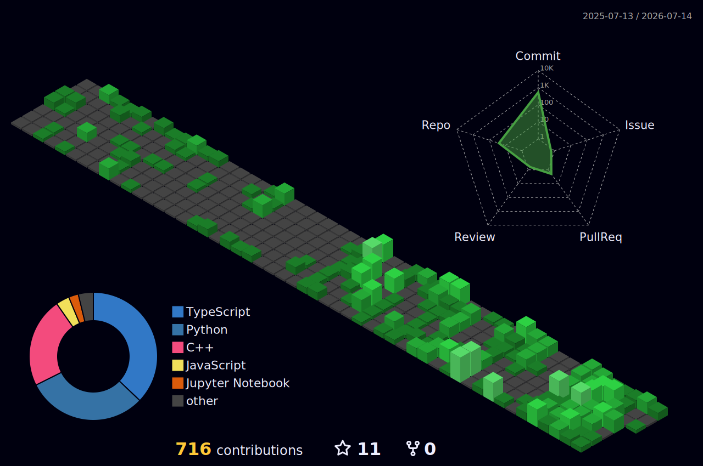

# Soman Abbasi

**Full-Stack Developer | AI Engineer**

[Email](mailto:contact.somanabbasi@gmail.com) · [Portfolio](https://www.somanabbasi.tech/) · [LinkedIn](https://www.linkedin.com/in/soman-abbasi-a1820b344/) · [GitHub](https://github.com/SomanAbbasi)

---

## About

Computer Science student at **PUCIT** specializing in Full-Stack Development and AI Engineering. I build scalable web applications, AI agents, RAG systems, and automation workflows.

I work across frontend, backend, databases, and production-oriented software — with a strong foundation in algorithms and system design.

I am looking for roles in **Full-Stack Development** and **AI Engineering**. More of my work is on [somanabbasi.tech](https://www.somanabbasi.tech/).

---

## Experience

### Full-Stack Developer Intern (AI Integrations)
**SKAFS International (Pvt) Ltd** · June 2026 – Present

- Built full-stack applications with AI-powered workflows, including LLM chatbots, RAG pipelines, and multi-agent systems for production use.
- Developed and deployed end-to-end AI agent systems with LangChain and LangGraph, including memory, tool use, and validation layers.

### Full-Stack Developer — Freelance
**2025**

- Delivered MERN and Next.js client projects, including a food ordering platform and a healthcare management app with authentication and role-based access.
- Collaborated on a music streaming application (Tswangi Music App), connecting the frontend to backend APIs and services.

---

## Featured Projects

### WhatsApp Agent — Ava
**GitHub:** [SomanAbbasi/Whatsapp-Agent](https://github.com/SomanAbbasi/Whatsapp-Agent)

- WhatsApp AI companion powered by LangGraph and Groq (Llama 3.3 70B), integrated with the Meta WhatsApp Cloud API for natural, persona-driven replies.
- Short-term memory with SQLite and long-term per-user memory with Qdrant, plus image generation, image understanding, and voice transcription/replies.

**Tech:** `Python` · `LangGraph` · `Groq` · `WhatsApp Cloud API` · `Qdrant` · `Hugging Face` · `ElevenLabs` · `FastAPI` · `SQLite`

### DentalAgent — AI Dental Receptionist
**GitHub:** [SomanAbbasi/Dental-Agent](https://github.com/SomanAbbasi/Dental-Agent)

- Multilingual AI receptionist (English, Urdu, Punjabi, Saraiki) that books dental appointments through natural conversation over REST and WebSocket APIs.
- Intelligent date/time parsing and validation, RAG over clinic policy documents with FAISS, and safety guardrails against prompt injection.

**Tech:** `Python` · `FastAPI` · `LangGraph` · `OpenRouter` · `FAISS` · `WebSocket` · `RAG`

### Slack Clone
**GitHub:** [SomanAbbasi/Slack-Lite](https://github.com/SomanAbbasi/Slack-Lite)

- Real-time messaging platform with workspace and channel architecture, role-based permissions, live synchronization, and a responsive UI.

**Tech:** `Next.js` · `TypeScript` · `Convex`

More projects and case studies: [somanabbasi.tech](https://www.somanabbasi.tech/)

---

## Technical Skills

**Languages:** Python, C/C++, C#, JavaScript, TypeScript

**Frontend:** React.js, Next.js, HTML5, CSS3, Tailwind CSS

**Backend:** Node.js, Express.js, Flask, FastAPI, REST APIs

**AI / ML:** LangChain, LangGraph, n8n, OpenAI, Gemini, Groq, Hugging Face, RAG, AI Agents, Prompt Engineering, MCP

**Databases:** PostgreSQL, MySQL, MongoDB, Convex

**Vector & Infra:** FAISS, ChromaDB, Pinecone

**Tools:** Docker, Git, GitHub, Linux, Postman

---

## Competitive Programming

ICPC Regionalist

---

## Education

**PUCIT, University of the Punjab** — Lahore, Pakistan  
Bachelor of Science in Computer Science · Expected 2028

---

## GitHub Activity

 
 

 
 

---

Open to Full-Stack and AI Engineering opportunities.

[Email](mailto:contact.somanabbasi@gmail.com) · [Portfolio](https://www.somanabbasi.tech/) · [LinkedIn](https://www.linkedin.com/in/soman-abbasi-a1820b344/)

